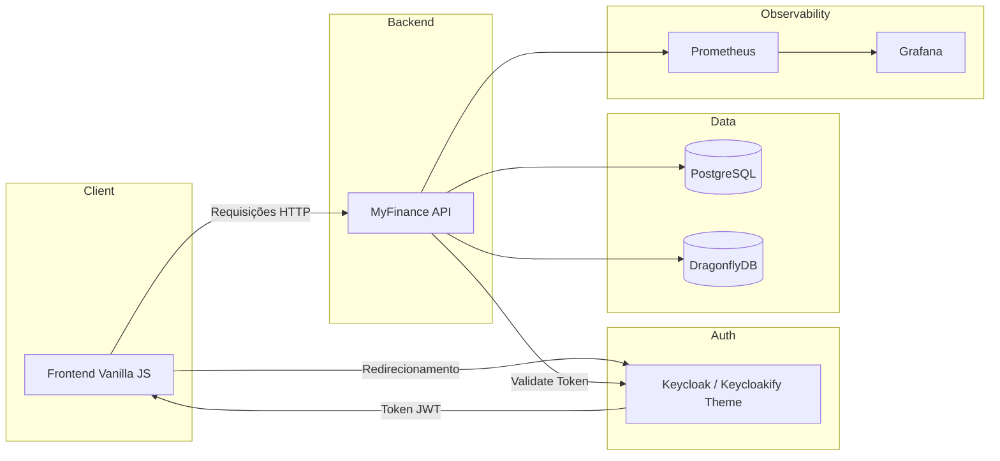

# 💰 My Finance App (Fullstack)


<br/>

> Sistema fullstack completo para gestão de finanças pessoais — com API RESTful em Java, frontend SPA em Vanilla JS, autenticação enterprise via Keycloak, cache de alta performance com DragonflyDB e observabilidade completa com Prometheus/Grafana.

---

## 📑 Índice

- [📘 Contexto](#-contexto)
- [🧩 Arquitetura](#-arquitetura)
- [📂 Estrutura de Pastas](#-estrutura-de-pastas)
- [✨ Funcionalidades](#-funcionalidades)
- [🛠️ Tecnologias Utilizadas](#️-tecnologias-utilizadas)
- [🐳 Serviços Docker](#-serviços-docker-infrastructure)
- [⚙️ Configuração do Ambiente](#️-configuração-do-ambiente)
- [🚀 Como Executar](#-como-executar)
- [🔗 Acesso à Aplicação](#-acesso-à-aplicação)
- [🏅 Diferenciais do Projeto](#-diferenciais-do-projeto)
- [🛠️ Tags](#️-tags)

---

## 📘 Contexto

Sistema completo para gestão de finanças pessoais, composto por uma **API RESTful em Java (Spring Boot)** e uma aplicação **Frontend em Vanilla JavaScript (SPA)**. O projeto permite o controle de contas, transações, categorias e metas financeiras, contando com:

- 🔐 Autenticação robusta e interface de login customizada via **Keycloak** (Keycloakify)
- ⚡ Cache de alta performance com **DragonflyDB**
- 📈 Observabilidade completa com **Prometheus** e **Grafana**
- ☁️ Deploy em **Oracle Cloud Infrastructure**

---

## 🧩 Arquitetura



---

## 📂 Estrutura de Pastas

### 🖥️ Frontend Principal (Vanilla JS)

Arquitetura modular sem frameworks, focada em performance e separação de responsabilidades.

```plaintext
myfinance-frontend/
├── css/
│   └── style.css               # Estilos globais e componentes da UI
├── js/
│   ├── api.js                  # Centraliza chamadas fetch() e endpoints
│   ├── app.js                  # Inicialização principal
│   ├── auth.js                 # Integração e gerenciamento de token com Keycloak
│   ├── ui.js                   # Helpers visuais (Modais, Toasts, Formatadores)
│   └── pages/                  # Lógica específica de cada tela
│       ├── accounts.js
│       ├── categories.js
│       ├── dashboard.js
│       ├── goals.js
│       ├── transactions.js
│       └── users.js
└── index.html                  # Ponto de entrada da Single Page Application
```

### 🔐 Tema de Login (Keycloakify)

Interface de autenticação desenvolvida em React/Vite para integração direta com o servidor Keycloak.

```plaintext
myfinance-keycloak-theme/
├── src/
│   └── login/
│       ├── pages/
│       │   ├── Login.tsx                # Tela principal de entrada
│       │   ├── Register.tsx             # Tela de cadastro
│       │   ├── LoginResetPassword.tsx   # Recuperação de senha
│       │   └── myfinance-kc.css         # Estilização customizada (cores, background)
│       ├── KcPage.tsx                   # Roteador interno do Keycloak
│       └── i18n.ts                      # Internacionalização
└── package.json
```

---

## ✨ Funcionalidades

### 🖥️ Interface de Usuário (Frontend)

- **SPA (Single Page Application):** Navegação fluida e renderização dinâmica baseada em Vanilla JS.
- **Gestão Visual:** Cards interativos para acompanhamento de Metas (com barras de progresso) e Contas (ativas/inativas).
- **Modais e Feedbacks:** Interações baseadas em modais e notificações (Toasts) para ações de CRUD e aportes/resgates.

### 🔐 Segurança e Usuários

- **Keycloak (OIDC):** Autenticação e autorização centralizada.
- **Keycloakify:** Tema de login, registro e recuperação de senha totalmente customizado com a identidade visual do MyFinance.
- **RBAC:** Controle de acesso baseado em roles (`ADMIN`, `USER`).

### 💸 Gestão Financeira (API)

- **Contas & Categorias:** CRUD completo com ativação/desativação lógica.
- **Transações:** Registro de entradas, saídas e transferências entre contas.
- **Metas (Goals):** Controle de economia com funções de depósito e saque.
- **Dashboard:** Métricas consolidadas de gastos por categoria.

### ⚙️ Infraestrutura e Boas Práticas

- **Flyway:** Evolução controlada do schema do banco de dados.
- **DragonflyDB:** Cache compatível com Redis para alta performance.
- **AOP:** Log e tratamento de aspectos transversais.
- **Watchtower:** Atualização automática de containers em produção.

---

## 🛠️ Tecnologias Utilizadas

### Backend & Infraestrutura

| Categoria      | Tecnologia                                         |
|----------------|----------------------------------------------------|
| Linguagem      | Java 21                                            |
| Framework      | Spring Boot 4.0.1                                  |
| Banco de Dados | PostgreSQL 16                                      |
| Cache          | DragonflyDB v1.37                                  |
| Monitoramento  | Micrometer, Prometheus v2.52, Grafana 10.4         |
| Cloud          | Oracle Cloud Infrastructure (OCI)                 |

### Frontend & Segurança

| Categoria      | Tecnologia                                              |
|----------------|---------------------------------------------------------|
| Linguagem      | JavaScript (ES6+), HTML5, CSS3                          |
| Arquitetura UI | Vanilla JS estruturado em Módulos (Pages, API, UI)      |
| Segurança      | Keycloak 23.0 & Spring Security (OAuth2 Resource Server)|
| Tema de Login  | Keycloakify (React/Vite compilado para `.jar`)          |

---

## 🐳 Serviços Docker (Infrastructure)

| Serviço        | Imagem               | Porta | Descrição           |
|----------------|----------------------|-------|---------------------|
| my-finance-app | Build local          | 5050  | API Principal       |
| keycloak       | `keycloak:23.0`      | 5053  | Identity Provider   |
| postgres       | `postgres:16-alpine` | 5051  | DB Aplicação        |
| dragonfly      | `dragonfly:v1.37.0`  | 5052  | Cache Layer         |
| prometheus     | `prom/prometheus`    | 5054  | Coleta de Métricas  |
| grafana        | `grafana/grafana`    | 5055  | Dashboards          |

---

## ⚙️ Configuração do Ambiente

1. Crie uma cópia do arquivo `variaveis-de-ambiente.example.env` na raiz do projeto.
2. Renomeie a cópia para `.env` (removendo o `.example`).
3. Preencha as variáveis com suas credenciais conforme o exemplo abaixo:

```env
# 🗄️ BANCO DE DADOS PRINCIPAL
POSTGRES_DB=db
POSTGRES_USER=seu_usuario
POSTGRES_PASSWORD=sua_senha

# 🗄️ BANCO DE DADOS DO KEYCLOAK
KEYCLOAK_DB=keycloak
KEYCLOAK_DB_USER=seu_usuario_keycloak
KEYCLOAK_DB_PASSWORD=sua_senha_keycloak

# 👑 ADMINISTRADORES DO SISTEMA
ADMIN_EMAILS=admin1@exemplo.com,admin2@exemplo.com

# 🌐 CORS (Cross-Origin Resource Sharing)
CORS_ALLOWED_ORIGINS=http://localhost:3000

# 🔐 KEYCLOAK ADMIN
KEYCLOAK_ADMIN=admin@exemplo.com
KEYCLOAK_ADMIN_PASSWORD=senha_admin_keycloak

# 🔐 CONFIGURAÇÕES DO CLIENTE KEYCLOAK (my-finance-app)
CLIENT_ID=my-finance-app
CLIENT_SECRET=seu_client_secret_gerado_no_keycloak
ISSUER_URI=http://localhost:5053/realms/app

# 📊 OBSERVABILIDADE (Grafana)
GF_SECURITY_ADMIN_PASSWORD=senha_grafana
```

> ⚠️ **Atenção:** O arquivo `.env` real já está no `.gitignore`. Jamais commite suas credenciais reais no GitHub!

---

## 🚀 Como Executar

> **Pré-requisitos:** [Docker](https://www.docker.com/), [Docker Compose](https://docs.docker.com/compose/) e [Node.js](https://nodejs.org/) (para o build do tema Keycloakify).

### 1. Backend e Infraestrutura (Docker Compose)

Esta é a forma mais simples e garante que todos os serviços subam juntos.

```bash
# Na raiz do projeto, com o .env configurado:
docker compose up -d --build
```

A API estará disponível em `http://localhost:5050`.

### 2. Keycloakify (Tema Customizado do Keycloak)

```bash
# Na pasta myfinance-keycloak-theme:
npm install
npm run build-keycloak-theme
```

Copie o arquivo `.jar` gerado em `build_keycloak/target/` para a pasta `providers/` do seu servidor Keycloak (via volume do Docker) e reinicie o container.

### 3. Frontend Principal

Como o frontend utiliza Vanilla JS (Módulos ES6), ele **precisa ser servido por um servidor HTTP** (abrir o `index.html` com duplo clique pode causar erros de CORS).

```bash
# Na pasta myfinance-frontend, rodando na porta liberada no CORS:
npx serve -p 3000
```

Acesse `http://localhost:3000`. O redirecionamento para o login customizado no Keycloak ocorrerá automaticamente caso não haja um token válido.

---

## 🔗 Acesso à Aplicação

| Serviço          | URL                                     | Credenciais                       |
|------------------|-----------------------------------------|-----------------------------------|
| Frontend         | `http://localhost:3000`                 | Usuário registrado via Keycloak   |
| API Base URL     | `http://localhost:5050`                 | —                                 |
| Swagger UI       | `http://localhost:5050/swagger-ui.html` | —                                 |
| Keycloak Admin   | `http://localhost:5053`                 | Definidas no `.env`               |
| DragonflyDB      | `localhost:5052`                        | —                                 |
| Prometheus       | `http://localhost:5054`                 | —                                 |
| Grafana          | `http://localhost:5055`                 | `admin` / definido no `.env`      |

---

## 🏅 Diferenciais do Projeto

- 🧭 Documentação **Swagger / OpenAPI** integrada.
- 🔐 Autenticação enterprise com **Keycloak** (OAuth2 / OIDC) e tema 100% customizado via **Keycloakify**.
- 🐳 Orquestração completa com **Docker Compose** (8 serviços).
- ⚡ Cache de alta performance com **DragonflyDB**.
- 📈 Monitoramento completo com **Actuator**, **Prometheus** e **Grafana**.
- 🔄 Deploy contínuo com **Watchtower** (atualização automática dos contêineres).
- ☁️ Deploy em **Oracle Cloud Infrastructure**.
- 📋 Catálogo de erros padronizados entre Backend e Frontend.
- 🔀 **AOP** para separação de responsabilidades transversais.
- 🧵 **Virtual Threads** (Project Loom) para alta concorrência com baixo consumo de recursos.

---

## 🛠️ Tags

`#JavaScript` `#VanillaJS` `#Java` `#SpringBoot` `#Fullstack`
`#API` `#RestAPI` `#Docker` `#PostgreSQL` `#JPA` `#Flyway`
`#Swagger` `#Keycloak` `#Keycloakify` `#OAuth2`
`#DragonflyDB` `#Actuator` `#Prometheus` `#Grafana` `#OracleCloud`