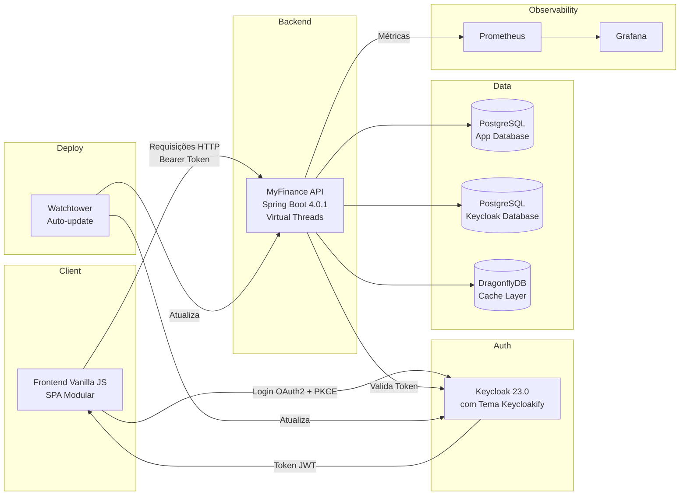

# 💰 MyFinance App (Fullstack)


<br/>

> Sistema fullstack completo para gestão de finanças pessoais — com API RESTful em Java (Spring Boot), frontend SPA em Vanilla JavaScript, autenticação enterprise via Keycloak com tema customizado em React (Keycloakify), cache de alta performance com DragonflyDB e observabilidade completa com Prometheus/Grafana.

---

## 📑 Índice

- [📘 Contexto](#-contexto)
- [🧩 Arquitetura](#-arquitetura)
- [📂 Estrutura de Pastas](#-estrutura-de-pastas)
- [✨ Funcionalidades](#-funcionalidades)
- [🛠️ Tecnologias Utilizadas](#️-tecnologias-utilizadas)
- [🐳 Serviços Docker](#-serviços-docker-infraestrutura)
- [⚙️ Configuração do Ambiente](#️-configuração-do-ambiente)
- [🚀 Como Executar](#-como-executar)
- [🔗 Acesso à Aplicação](#-acesso-à-aplicação)
- [🏅 Diferenciais do Projeto](#-diferenciais-do-projeto)
- [🛠️ Tags](#️-tags)

---

## 📘 Contexto

Sistema completo para gestão de finanças pessoais, composto por uma **API RESTful em Java (Spring Boot 4.0.1 + Java 21)** e uma aplicação **Frontend SPA em Vanilla JavaScript (ES6 Módulos)**. O projeto permite o controle de contas bancárias, transações financeiras, categorias de gastos e metas de economia, contando com:

- 🔐 Autenticação robusta via **Keycloak** com fluxo **OAuth2 + PKCE** e interface de login customizada em React via **Keycloakify**
- ⚡ Cache de alta performance com **DragonflyDB** (compatível Redis) e TTLs configurados por domínio
- 📈 Observabilidade completa com **Prometheus**, **Grafana** e métricas de negócio customizadas via **Micrometer**
- 📋 Catálogo de erros padronizados conforme **RFC 7807 (Problem Details)**
- ☁️ Deploy em **Oracle Cloud Infrastructure** com atualização automática via **Watchtower**

---

## 🧩 Arquitetura



---

## 📂 Estrutura de Pastas

### 🖥️ Frontend Principal (Vanilla JS)

Arquitetura modular sem frameworks, focada em performance e separação de responsabilidades. Implementa manualmente o fluxo OAuth2 Authorization Code com PKCE.

```plaintext
myfinance-frontend/
├── css/
│   └── style.css               # Estilos globais e componentes da UI
├── js/
│   ├── config.js                # Configuração de ambientes (localhost vs produção)
│   ├── api.js                   # Centraliza chamadas fetch() e endpoints da API
│   ├── app.js                   # Inicialização principal e bootstrap da SPA
│   ├── auth.js                  # OAuth2 + PKCE manual (code challenge, S256)
│   ├── ui.js                    # Helpers visuais (Modais, Toasts, Formatadores, Navegação)
│   └── pages/                   # Lógica específica de cada tela
│       ├── accounts.js          # Gestão de contas bancárias
│       ├── categories.js        # Categorias de receitas e despesas
│       ├── dashboard.js         # KPIs e inteligência financeira
│       ├── goals.js             # Metas e objetivos financeiros
│       ├── transactions.js      # Movimentações financeiras
│       └── users.js             # Perfil do usuário e painel admin
└── index.html                   # Ponto de entrada da Single Page Application
```

### 🔐 Tema de Login (Keycloakify)

Interface de autenticação desenvolvida em **React + TypeScript + Vite** para integração direta com o servidor Keycloak. Compilado para `.jar` e carregado como provider do Keycloak.

```plaintext
myfinance-keycloak-theme/
├── src/
│   ├── main.tsx                  # Entry point React
│   ├── kc.gen.tsx                # Tipagem gerada do contexto Keycloak
│   └── login/
│       ├── pages/
│       │   ├── Login.tsx                # Tela principal de entrada
│       │   ├── Register.tsx             # Tela de cadastro de usuários
│       │   ├── LoginResetPassword.tsx   # Recuperação de senha
│       │   └── myfinance-kc.css         # Estilização customizada (cores, background, branding)
│       ├── KcPage.tsx                   # Roteador interno das páginas Keycloak
│       ├── KcPageStory.tsx              # Suporte ao Storybook
│       ├── KcContext.ts                 # Tipagem do contexto
│       └── i18n.ts                      # Internacionalização (multi-idioma)
├── vite.config.ts
├── tsconfig.json
└── package.json
```

### ⚙️ API Backend (Spring Boot)

```plaintext
myfinance-api/
├── src/main/java/com/gustavosdaniel/myfinance_api/
│   ├── Application.java              # Entry point (Spring Boot)
│   ├── config/
│   │   ├── SecurityConfig.java       # OAuth2 Resource Server + CORS + RBAC
│   │   ├── CacheConfig.java          # Cache TTL por entidade (Redis/Dragonfly)
│   │   ├── OpenApiConfig.java        # Swagger/OpenAPI 3
│   │   └── JpaAuditingConfig.java    # Auditoria JPA
│   ├── controller/
│   │   ├── AccountController.java
│   │   ├── CategoryController.java
│   │   ├── DashboardController.java
│   │   ├── GoalController.java
│   │   ├── TransactionController.java
│   │   ├── UserController.java
│   │   ├── ErrorController.java      # Documentação de erros (RFC 7807)
│   │   └── metrics/                  # Métricas customizadas por domínio (Micrometer)
│   ├── service/                      # Camada de lógica de negócio
│   ├── repository/                   # Repositórios JPA + Specifications
│   ├── domain/                       # Entidades JPA, DTOs, Enums e Mappers
│   ├── exception/                    # Exceções de domínio tipadas
│   │   └── handle/
│   │       ├── GlobalExceptionHandle.java  # Handler global (RFC 7807)
│   │       └── ProblemType.java            # Catálogo de tipos de erro
│   └── util/
│       ├── AuthHelper.java           # Sincronização Keycloak ↔ DB local
│       ├── ErroDocRegistry.java      # Registro de documentação de erros
│       └── MetricsBuilder.java       # Builder de métricas customizadas
├── src/main/resources/
│   ├── application.yaml              # Configuração padrão (dev local)
│   ├── application-docker.yaml       # Configuração para perfil Docker
│   └── db/migration/                 # Migrações Flyway versionadas
├── monitoring/
│   └── prometheus.yml                # Configuração de scrape do Prometheus
├── docker-compose.yml                # Orquestração de todos os serviços
├── Dockerfile                        # Build multi-stage (Maven → JRE)
└── variaveis-de-ambiente.example.env # Template de variáveis de ambiente
```

---

## ✨ Funcionalidades

### 🖥️ Interface de Usuário (Frontend)

- **SPA (Single Page Application):** Navegação fluida sem recarregamento de página, renderização dinâmica baseada em Vanilla JS (ES6 Módulos).
- **Autenticação OAuth2 + PKCE:** Implementação manual do fluxo Authorization Code com PKCE (SHA-256), sem dependência de adaptadores Keycloak JS.
- **Detecção automática de ambiente:** Configuração dinâmica de endpoints (localhost vs produção) via `config.js`.
- **Gestão Visual:** Cards interativos para acompanhamento de Metas (com barras de progresso) e Contas (ativas/inativas).
- **Modais e Feedbacks:** Interações baseadas em modais e notificações (Toasts) para ações de CRUD e aportes/resgates.
- **Menu lateral responsivo:** Sidebar com avatar do usuário, role (Admin/User) e navegação colapsável em dispositivos móveis.

### 🔐 Segurança e Usuários

- **Keycloak 23.0 (OIDC):** Autenticação e autorização centralizada — provedor de identidade enterprise.
- **Keycloakify 11:** Tema de login, registro e recuperação de senha totalmente customizado em React + TypeScript com a identidade visual do MyFinance. Empacotado como `.jar` para deploy direto no Keycloak.
- **RBAC:** Controle de acesso baseado em roles (`ADMIN`, `USER`) extraídas dinamicamente dos claims do JWT (realm_access + resource_access).
- **Sincronização automática:** Usuários do Keycloak são automaticamente registrados no banco local no primeiro acesso (via `AuthHelper`), com role atribuída dinamicamente por e-mail.

### 💸 Gestão Financeira (API)

- **Contas & Categorias:** CRUD completo com ativação/desativação lógica (soft delete).
- **Transações:** Registro de entradas (receitas), saídas (despesas) e transferências entre contas com estados (Pendente → Confirmada/Cancelada).
- **Idempotência:** Suporte a chave de idempotência (`Idempotency-Key`) para evitar duplicidade de transações.
- **Metas (Goals):** Controle de economia com funções de depósito e saque, acompanhamento visual de progresso.
- **Dashboard:** Métricas consolidadas de gastos por categoria em intervalo de datas configurável.
- **Catálogo de Erros:** Documentação interativa de todos os erros da API via endpoint `/erros`, padronizados conforme RFC 7807 (Problem Details for HTTP APIs).

### ⚙️ Infraestrutura e Boas Práticas

- **Flyway:** Evolução controlada do schema do banco com migrações versionadas.
- **DragonflyDB:** Cache compatível com Redis, com TTLs customizados por domínio (contas: 1h, categorias: 24h, dashboards: 5min, etc.).
- **Virtual Threads (Project Loom):** Threads virtuais habilitadas para alta concorrência com baixo consumo de recursos.
- **AOP:** Log e tratamento de aspectos transversais.
- **Watchtower:** Atualização automática de containers Docker em produção (polling a cada 5 minutos).
- **Métricas Customizadas:** Métricas de negócio por domínio (contas criadas, transações processadas, usuários registrados, etc.) expostas via Micrometer para o Prometheus.

---

## 🛠️ Tecnologias Utilizadas

### Backend & Infraestrutura

| Categoria        | Tecnologia                                                   |
|------------------|--------------------------------------------------------------|
| Linguagem        | Java 21                                                      |
| Framework        | Spring Boot 4.0.1                                            |
| Segurança        | Spring Security (OAuth2 Resource Server) + JWT               |
| Banco de Dados   | PostgreSQL 16 (Alpine) — duas instâncias (App + Keycloak)    |
| Cache            | DragonflyDB v1.37 (compatível Redis)                         |
| Migrações        | Flyway (PostgreSQL)                                          |
| Documentação     | SpringDoc OpenAPI 3 + Swagger UI                             |
| Monitoramento    | Micrometer, Prometheus v2.52, Grafana 10.4                   |
| Concorrência     | Virtual Threads (Project Loom)                               |
| Conexões DB      | HikariCP (Connection Pool)                                   |
| Build            | Maven 3.9 + Docker Multi-stage Build                         |
| Cloud            | Oracle Cloud Infrastructure (OCI)                            |
| Auto-deploy      | Watchtower 1.7.1                                             |

### Frontend & Segurança

| Categoria        | Tecnologia                                                   |
|------------------|--------------------------------------------------------------|
| Linguagem        | JavaScript (ES6+ Módulos), HTML5, CSS3                       |
| Arquitetura UI   | Vanilla JS estruturado em módulos (Pages, API, Auth, UI)     |
| Autenticação     | OAuth2 Authorization Code + PKCE (SHA-256) — implementação manual |
| Identity Provider| Keycloak 23.0                                                |
| Tema de Login    | Keycloakify 11 (React 18 + TypeScript 5 + Vite 5)            |
| Servidor Local   | `serve` (HTTP estático para módulos ES6)                     |

---

## 🐳 Serviços Docker (Infraestrutura)

O projeto utiliza **8 serviços** orquestrados via Docker Compose, com healthchecks e políticas de restart:

| Serviço             | Imagem                                  | Porta (Host) | Porta (Container) | Descrição                      |
|---------------------|-----------------------------------------|--------------|--------------------|--------------------------------|
| my-finance-app      | Build local (Dockerfile)                | 5050         | 5050               | API Principal (Spring Boot)    |
| keycloak            | `quay.io/keycloak/keycloak:23.0`        | 5053         | 8080               | Identity Provider (OIDC)       |
| postgres            | `postgres:16-alpine`                    | 5051         | 5432               | Banco de dados da aplicação    |
| postgres-keycloak   | `postgres:16-alpine`                    | —            | 5432               | Banco de dados do Keycloak     |
| dragonfly           | `ghcr.io/dragonflydb/dragonfly:v1.37.0` | 5052         | 6379               | Cache Layer (Redis-compatible) |
| prometheus          | `prom/prometheus:v2.52.0`               | 5054         | 9090               | Coleta de Métricas             |
| grafana             | `grafana/grafana:10.4.2`                | 5055         | 3000               | Dashboards de Observabilidade  |
| watchtower          | `containrrr/watchtower:1.7.1`           | —            | —                  | Atualização automática de containers |

> 💡 **Nota:** O banco do Keycloak (`postgres-keycloak`) e o Watchtower não expõem portas para o host — operam apenas na rede interna `myfinance-network`.

---

## ⚙️ Configuração do Ambiente

1. Navegue até a pasta `myfinance-api/`:
   ```bash
   cd myfinance-api
   ```

2. Crie uma cópia do arquivo `variaveis-de-ambiente.example.env`.

3. Renomeie a cópia para `.env` (removendo o `.example`).

4. Preencha as variáveis com suas credenciais conforme o exemplo abaixo:

```env
# ====================================================================
# 🗄️ BANCO DE DADOS PRINCIPAL
# ====================================================================
POSTGRES_DB=db
POSTGRES_USER=seu_usuario
POSTGRES_PASSWORD=sua_senha

# ====================================================================
# 🗄️ BANCO DE DADOS DO KEYCLOAK
# ====================================================================
KEYCLOAK_DB=keycloak
KEYCLOAK_DB_USER=seu_usuario_keycloak
KEYCLOAK_DB_PASSWORD=sua_senha_keycloak

# ====================================================================
# 👑 ADMINISTRADORES DO SISTEMA
# ====================================================================
# E-mails que receberão role ADMIN automaticamente (separados por vírgula)
ADMIN_EMAILS=admin1@exemplo.com,admin2@exemplo.com

# ====================================================================
# 🌐 CORS (Cross-Origin Resource Sharing)
# ====================================================================
CORS_ALLOWED_ORIGINS=http://localhost:3000

# ====================================================================
# 🔐 KEYCLOAK ADMIN
# ====================================================================
KEYCLOAK_ADMIN=admin@exemplo.com
KEYCLOAK_ADMIN_PASSWORD=senha_admin_keycloak

# ====================================================================
# 🔐 CONFIGURAÇÕES DO CLIENTE KEYCLOAK (my-finance-app)
# ====================================================================
CLIENT_ID=my-finance-app
CLIENT_SECRET=seu_client_secret_gerado_no_keycloak
ISSUER_URI=http://localhost:5053/realms/my-finance-app

# ====================================================================
# 📊 OBSERVABILIDADE (Grafana)
# ====================================================================
GF_SECURITY_ADMIN_PASSWORD=senha_grafana
```

> ⚠️ **Atenção:** O arquivo `.env` real já está no `.gitignore`. Jamais commite suas credenciais reais no GitHub!

> 💡 **Configuração do Keycloak:** Após subir os containers pela primeira vez, acesse o [Keycloak Admin Console](http://localhost:5053), crie o realm `my-finance-app`, configure o client `my-finance-app` com o fluxo OAuth2 Authorization Code + PKCE, e obtenha o `CLIENT_SECRET` para preencher no `.env`.

---

## 🚀 Como Executar

> **Pré-requisitos:** [Docker](https://www.docker.com/), [Docker Compose](https://docs.docker.com/compose/) e [Node.js](https://nodejs.org/) (para o frontend e build do tema Keycloakify).

### 1. Backend e Infraestrutura (Docker Compose)

Esta é a forma mais simples e garante que todos os 8 serviços subam juntos com saúde verificada.

```bash
# Na pasta myfinance-api, com o .env configurado:
cd myfinance-api
docker compose up -d --build
```

A API estará disponível em `http://localhost:5050`.

> 📋 **Ordem de inicialização:** O `my-finance-app` só inicia após `postgres` e `dragonfly` estarem saudáveis. O `keycloak` aguarda o `postgres-keycloak`. Serviços com `restart: unless-stopped` reiniciam automaticamente em caso de falha.

### 2. Keycloakify (Tema Customizado do Keycloak)

```bash
# Na pasta myfinance-keycloak-theme:
cd myfinance-keycloak-theme
npm install
npm run build-keycloak-theme
```

Copie o arquivo `.jar` gerado em `dist_keycloak/` para a pasta `providers/` do seu servidor Keycloak (via volume do Docker) e reinicie o container.

> 💡 **Storybook disponível:** Execute `npm run storybook` para visualizar os componentes do tema isoladamente durante o desenvolvimento.

### 3. Frontend Principal

O frontend utiliza **módulos ES6 nativos** (`type="module"`), portanto **precisa ser servido por um servidor HTTP** — abrir o `index.html` diretamente no navegador causará erros de CORS e MIME type.

```bash
# Na pasta myfinance-frontend, rodando na porta configurada no CORS (.env):
cd myfinance-frontend
npx serve -p 3000
```

Acesse `http://localhost:3000`. O redirecionamento para o login customizado no Keycloak ocorrerá automaticamente caso não haja um token JWT válido no `localStorage`.

---

## 🔗 Acesso à Aplicação

| Serviço             | URL                                          | Credenciais                        |
|---------------------|----------------------------------------------|------------------------------------|
| Frontend            | `http://localhost:3000`                      | Usuário registrado via Keycloak    |
| API Base URL        | `http://localhost:5050`                      | —                                  |
| Swagger UI          | `http://localhost:5050/swagger-ui.html`      | —                                  |
| Catálogo de Erros   | `http://localhost:5050/erros`                | —                                  |
| Keycloak Admin      | `http://localhost:5053`                      | Definidas no `.env`                |
| Prometheus          | `http://localhost:5054`                      | —                                  |
| Grafana             | `http://localhost:5055`                      | `admin` / definido no `.env`       |

---

## 🏅 Diferenciais do Projeto

- 🧭 Documentação **Swagger / OpenAPI 3** integrada com SpringDoc.
- 🔐 Autenticação enterprise com **Keycloak** (OAuth2 / OIDC) e fluxo **Authorization Code + PKCE** implementado manualmente no frontend Vanilla JS — sem adaptadores pesados.
- 🎨 Tema de login 100% customizado via **Keycloakify** (React + TypeScript + Vite), compilado para `.jar`.
- 🐳 Orquestração completa com **Docker Compose** (8 serviços, com healthchecks e políticas de restart).
- 🗄️ **Dois bancos PostgreSQL** isolados: um para a aplicação e outro dedicado ao Keycloak (padrão database-per-service).
- ⚡ Cache de alta performance com **DragonflyDB** e TTLs customizados por domínio de negócio.
- 📈 Monitoramento completo com **Micrometer**, métricas de negócio customizadas, **Prometheus** e **Grafana**.
- 📋 Catálogo de erros padronizados conforme **RFC 7807 (Problem Details)** com documentação interativa e URIs navegáveis por tipo de erro.
- 🔄 Deploy contínuo com **Watchtower** (atualização automática de containers a cada 5 minutos).
- ☁️ Deploy em **Oracle Cloud Infrastructure** (acessível em [myfinance.gustavosdaniel.com](https://myfinance.gustavosdaniel.com)).
- 🧵 **Virtual Threads** (Project Loom) para alta concorrência com baixo consumo de recursos.
- 🔀 **AOP** para separação de responsabilidades transversais (logging, métricas).
- 🔑 Suporte a **idempotência** em transações financeiras (`Idempotency-Key`).
- 👥 Sincronização automática de usuários **Keycloak → Banco Local** no primeiro acesso, com role dinâmica por e-mail.

---

## 🛠️ Tags

`#JavaScript` `#VanillaJS` `#TypeScript` `#React` `#Java` `#SpringBoot` `#Fullstack`
`#RESTAPI` `#Docker` `#DockerCompose` `#PostgreSQL` `#JPA` `#Hibernate` `#Flyway` `#HikariCP`
`#Swagger` `#OpenAPI` `#Keycloak` `#Keycloakify` `#OAuth2` `#PKCE` `#OIDC` `#JWT`
`#DragonflyDB` `#Redis` `#Micrometer` `#Actuator` `#Prometheus` `#Grafana`
`#VirtualThreads` `#RFC7807` `#OracleCloud` `#Watchtower` `#DevOps`
